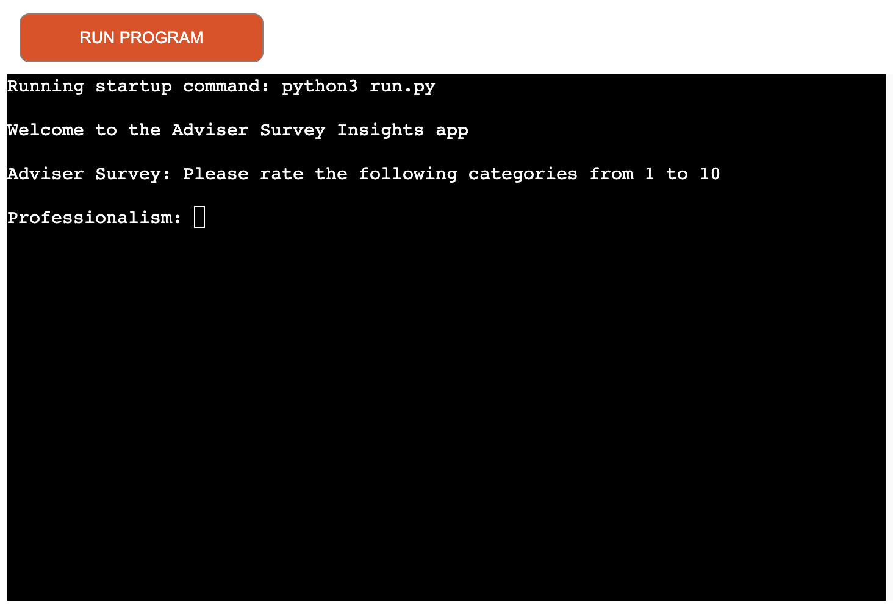
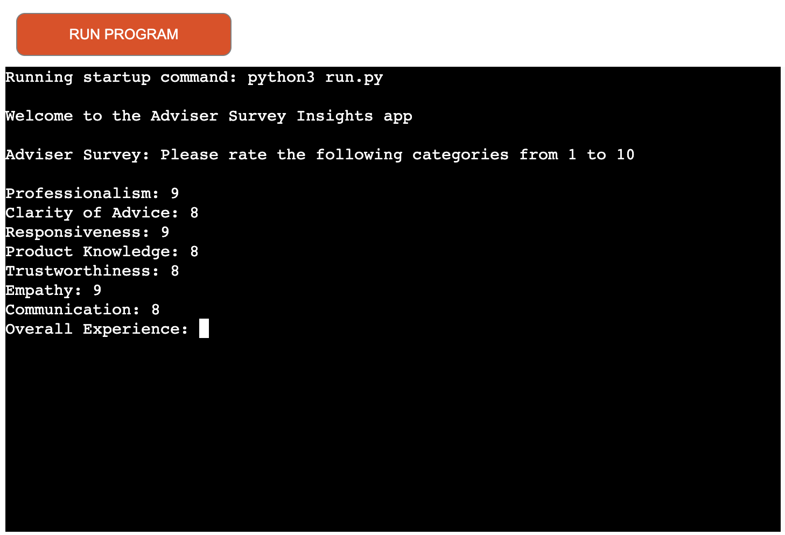
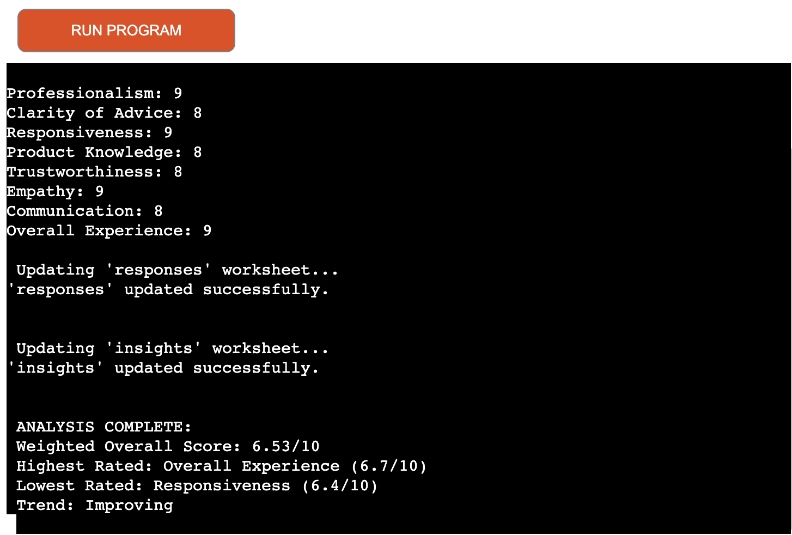
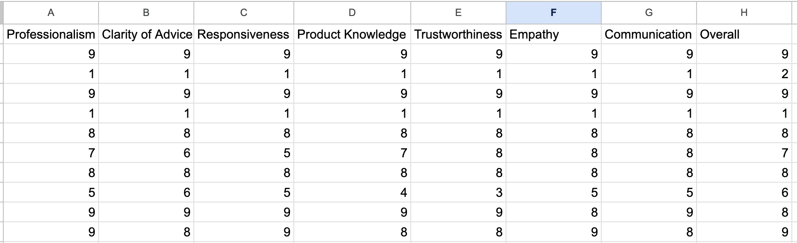
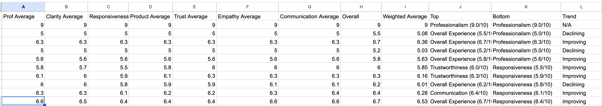

# Adviser Survery Insights Tool

Project 3 - Simon Vaz

View github repository:
Vieww live deployed project on Heroku: 

## Overview

The **Aviser Survery Insights Tool** is a phyton based terminal application that helps an Investment Management company track and analyse the performace of their advisers based on client/investor feedback. The tool prompts users to input 8 different ratings on different service areas. It then imports and stores the data in a Google Sheet. Calculations via functions implemented in the code provide meaningful insights such as weighted overall score, performance trends and category averages. This should help the firm make data-informed decisions to improve client experience.

## Purpose 

- Quantifies strengths and weaknesses of adviser performance
- Calculates a weighted average to prioritise the most important service areas
- Shows trends in performance over time
- Displays and stores raw data as well as insights for transparency and reporting

## Intended Users 

- Administrators - input the client feedback
- Management teams - review and act on adviser quality
- Advisers - Review and reflect on responses/insights to create actionable objectives

## Features

### 1. Survey Input (Function: 'get_survey_data')

This function prompts users to rate 8 adviser service categories on a scale from 1 to 10:

- Professionalism
- Clarity of Advice
- Responsiveness
- Product Knowledge
- Trustworthiness
- Empathy
- Communication
- Overall Experience

Each rating is validated to ensure it's a valid integer between 1 and 10. If incorrect input is detected (e.g. a letter, number above 10, etc.), the user is informed of the invalid input and prompted again.

---

### 2. Data Storage (Function: 'update_worksheet')

Once a full set of 8 ratings is entered, the data is appended as a new row in the `responses` worksheet within the connected Google Sheet. This maintains a full history of all responses.

The `insights` worksheet is also updated after analysis is performed. 

---

### Analysis Functions

### 3. Function: 'get_all_responses'

This function pulls all numeric data from the `responses` worksheet and returns it as a list of integer lists with each row being one complete survey.

---

### 4. Function: 'calculate_averages'

This function calculates the average rating per category from all recorded responses. Each time a user submits their survey ratings, a new row is added to the responses worksheet. Analysis is done using the following steps:

1. The 'data' in 'calculate_averages(data)' is a list of lists with each inner being one row in the responses sheet
2. 'zip(*data)' transposes the data and turns the rows into columns so you can calculate the average per category
3. Each column, now a list of all scores for that category, is summed and divided by how many entries exist
4. This provides a list of 8 averages, one per survey question

---

### 5. Function: 'calculate_weighted_average

Constants have been set at the start of the code that assigns weights to each survey question based on how important the category is. These weights are used in the function to calculate a more meaningful overall score across all categories.

1. The 'averages' in 'calculate_weighted_average' is the average score taken from the 'calculate_averages' function
2. Each score is multiplied by its weight in order to give more points to more important questions
3. All the new weighted scores are summed and all the wweights are summed
4. The total score is then divided by the total weights to give a funal weighted average score

---

### 6. Function: 'find_outliers'

This is a simple function used to identify the highest and lowest rated categories. Averages are input and indexed against the questions match thee highest/lowest score with a particular question. The function then returns a readable sting displaying the results. 

The intention of this function is to provide quick insights into where advisers are doing particularly well and where improvements are needed.

### 7. Function: 'calculate_trend'

This function compares the most recent two rows in the 'insights' sheet to determine how the overall weighted score has been changed. It has been designed to track how overall performance is changing over time based on past survey data:
- If the score is improving: "Improving"
- If the score decreased: "Declining"
- If the score stayed the same: "Steady"

The code is executed as below:

1. The insights sheet is accessed to retrieve all past insights rows as a list of lists
2. A check is in place to ensure there is enough data i.e. 2 entries. If there is not, 'N/A' is returned
3. The previous and current weighted average values are extracted from the 9th column in the insights sheet
4. These 2 scores are then compared and a readable ouput is output

## Supporting Imagery

### Initial Prompt

### All but one questions answered to show question structure

### Final Output

### Google Sheets Responses Sheet

### Google Sheets Insights Sheet

## Testing 

This section outlines the manual testing carried out to ensure that the Adviser Survey Insights Tool functions as intended. Each core feature was tested against expected outcomes, including input validation, spreadsheet interaction, and insight calculations.

### Manual Testing
<table>
  <thead>
    <tr>
      <th>Test No.</th>
      <th>Feature</th>
      <th>Test Action</th>
      <th>Expected Outcome</th>
      <th>Pass/Fail</th>
    </tr>
  </thead>
   <tbody>
    <tr>
      <td>1</td>
      <td>get_survey_data() - Valid Input</td>
      <td>Enter 8 valid integers (1–10)</td>
      <td>All values accepted and returned as a list</td>
      <td>Pass</td>
    </tr>
    <tr>
      <td>2</td>
      <td>get_survey_data() - Invalid Number</td>
      <td>Enter a number outside 1–10</td>
      <td>Shows error and prompts re-entry</td>
      <td>Pass</td>
    </tr>
    <tr>
      <td>3</td>
      <td>get_survey_data() - Non-integer</td>
      <td>Enter letters instead of a number</td>
      <td>Error shown; re-prompted</td>
      <td>Pass</td>
    </tr>
    <tr>
      <td>4</td>
      <td>update_worksheet()</td>
      <td>Append valid row to "responses"</td>
      <td>Row is added to worksheet</td>
      <td>Pass</td>
    </tr>
    <tr>
      <td>5</td>
      <td>get_all_responses()</td>
      <td>Pull data from "responses" tab</td>
      <td>Returns clean list of integer lists</td>
      <td>Pass</td>
    </tr>
    <tr>
      <td>6</td>
      <td>calculate_averages()</td>
      <td>Use list of responses to calculate per-question average</td>
      <td>Returns 8 floats rounded to 1dp</td>
      <td>Pass</td>
    </tr>
    <tr>
      <td>7</td>
      <td>calculate_weighted_average()</td>
      <td>Apply weights to averages list</td>
      <td>Returns overall weighted average (float)</td>
      <td>Pass</td>
    </tr>
    <tr>
      <td>8</td>
      <td>find_outliers()</td>
      <td>Identify highest/lowest scoring questions</td>
      <td>Returns strings of highest and lowest</td>
      <td>Pass</td>
    </tr>
    <tr>
      <td>9</td>
      <td>calculate_trend() – Not enough data</td>
      <td>Run with fewer than 2 rows in "insights"</td>
      <td>Returns "N/A"</td>
      <td>Pass</td>
    </tr>
    <tr>
      <td>10</td>
      <td>calculate_trend() – Improving</td>
      <td>Run with increasing weighted score</td>
      <td>Returns "Improving"</td>
      <td>Pass</td>
    </tr>
    <tr>
      <td>11</td>
      <td>calculate_trend() – Declining</td>
      <td>Run with decreasing weighted score</td>
      <td>Returns "Declining"</td>
      <td>Pass</td>
    </tr>
    <tr>
      <td>12</td>
      <td>End-to-End Test</td>
      <td>Run full survey with valid data</td>
      <td>Updates both worksheets and shows summary in terminal</td>
      <td>Pass</td>
    </tr>
  </tbody>
</table>

### Python checker

## Bugs/Improvements
- A bug I found while testing was the calcualte_trend function was being called too early in the main() thus comparing the previous-to-last row and the current last row before the new row was added. To fix this, I adjusted the insights row to not include trend then re-called the sheet to calculate the trend after the insights sheet was updated.
- When the insights worksheet is missing or misnamed, the program crashes with a WorksheetNotFound error. A future improvement would be to add a clearer error message or create the worksheet automatically if it doesn't exist.
- Each row of insights lacks a date or timestamp, making it hard to track when a survey was submitted. In a future version, a datetime field could be automatically appended to each new response.
- Trend could be calculated over a larger data-set e.g. last 2 entries, last 5 entries and last 10 entries. This would be dependent on sample sizes however could aid in building a better long term picture of trends.
- An optional text feedback input could be added. This might give management greater context as to how the ratings were decided and provide further action points.